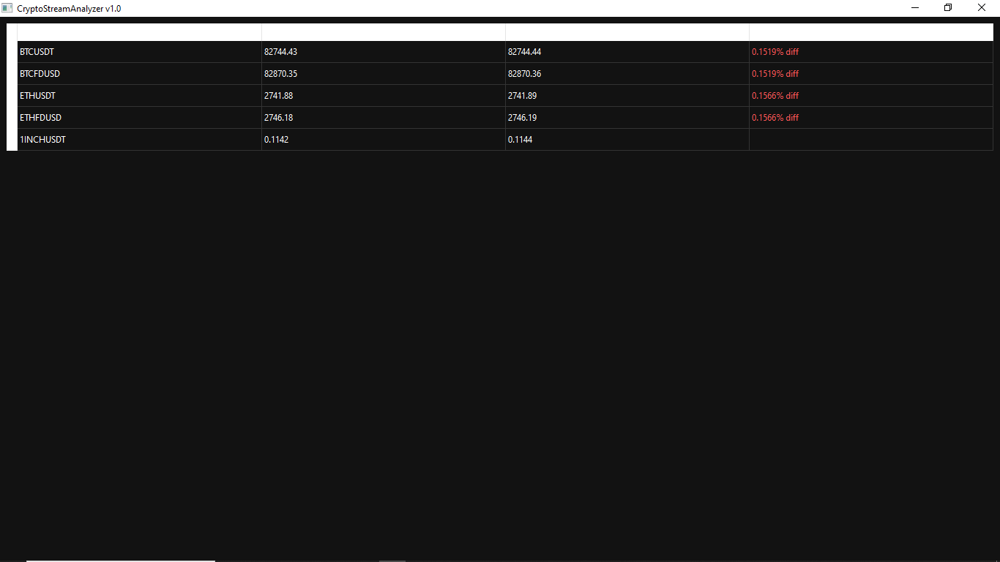

# CryptoStreamAnalyzer 🚀

**CryptoStreamAnalyzer** is a real-time cryptocurrency market analysis tool built in **Python**, designed to detect arbitrage anomalies between logically related trading pairs on **Binance**.

The project focuses on **low-latency data processing**, **WebSocket streaming**, and **market inefficiency detection**, making it suitable for quantitative research and automated trading systems.

---

## 💼 Client-Oriented Overview

This project demonstrates how I build:
- Real-time crypto market monitoring tools
- Arbitrage and price anomaly scanners
- Low-latency WebSocket-based systems
- Extendable analytics tools for trading research

Typical client use cases:
- Price discrepancy monitoring
- Arbitrage opportunity research
- Custom alert systems
- Market microstructure analysis

---

## 💼 Why This Project Matters (For Clients)

This tool demonstrates my ability to:
- Build low-latency trading analytics systems
- Work with real-time WebSocket data
- Detect market inefficiencies programmatically
- Design extensible architectures for trading bots
- Create desktop monitoring dashboards

Possible client use cases:
- Custom arbitrage scanners
- Signal generators for trading bots
- Market monitoring tools
- Research tools for quantitative strategies

---

## 🧠 Project Overview

Modern crypto markets often exhibit short-lived price inefficiencies between related trading pairs (e.g. the same asset quoted in different stablecoins).

CryptoStreamAnalyzer:
- Streams **Bid/Ask prices in real time**
- Groups related trading pairs by base asset
- Calculates spread deviations
- Highlights abnormal price differences exceeding predefined thresholds

This project was built as a **practical market analysis tool**, not a simulation.

---

## ⚙️ Core Concepts Implemented

- Real-time WebSocket data ingestion
- Event-driven price comparison
- Spread and anomaly detection logic
- Configurable per-asset thresholds
- Structured logging for post-analysis
- GUI-based real-time monitoring

---

## ✨ Key Features

- **Low-Latency WebSocket Streaming**  
  Uses Binance WebSocket API to receive live Bid/Ask updates without REST polling delays.

- **Logical Pair Grouping**  
  Price comparisons are restricted to related trading pairs (same base asset).

- **Per-Asset Anomaly Thresholds**  
  Each asset has its own configurable percentage threshold.

- **CSV-Based Opportunity Logging**  
  All detected anomalies are logged with timestamps for later analysis.

- **Dark-Themed GUI Dashboard**  
  Real-time visualization with highlighted spreads and anomalies.

---

## 📊 Example Use Cases

- Arbitrage opportunity research
- Stablecoin liquidity imbalance analysis
- Signal generation for trading bots
- High-frequency spread monitoring
- Crypto market microstructure studies

---

## 🛠 Tech Stack

- **Language:** Python  
- **Data Streaming:** Binance WebSocket API  
- **GUI:** Desktop-based real-time interface  
- **Data Storage:** CSV (for lightweight analytics & Pandas integration)

---

## 🛠 Installation

```bash
git clone https://github.com/VasylK27/CryptoStreamAnalyzer.git
cd CryptoStreamAnalyzer
python -m venv venv
source venv/bin/activate   # Linux / macOS
venv\Scripts\activate      # Windows
pip install -r requirements.txt
```

---

## ⚙️ Configuration
All monitored assets and thresholds are defined in config.json.

---

## ▶️ Running the Application

```bash
python main.py
```

After launch:
WebSocket streams start immediately
GUI updates in real time
Abnormal spreads are visually highlighted
All detected anomalies are logged to CSV

---

## 📁 Output Data
Detected opportunities are stored locally in CSV format and include:
- Timestamp
- Asset
- Trading pairs
- Spread percentage
- Price details
This data can be directly analyzed using Pandas, Excel, or BI tools.

---

## 🧩 Architecture Notes
- Event-driven processing (no blocking REST loops)
- Minimal latency between price update and analysis
- Designed to be easily extended for:
- Automated trading
- Database storage
- Futures market support

---

## ⚠️ Disclaimer
This project is intended for educational and research purposes only.
It does not provide financial advice or guarantee profitability.

---

## 📜 License
MIT License

---


